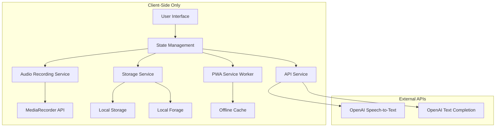
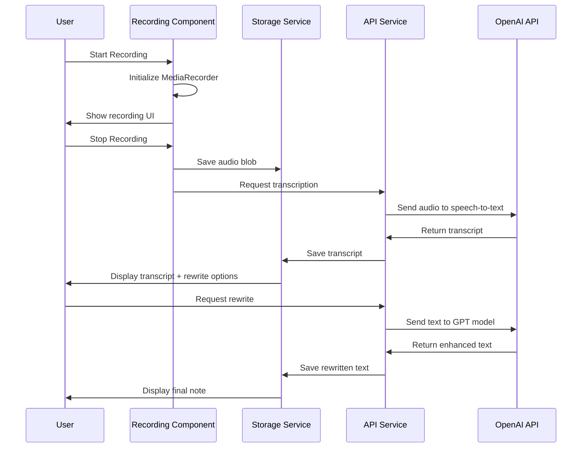

# Design Document

## Overview

The "Thoughts to Text" application is a Progressive Web App built with Next.js 15 App Router, React 19, TypeScript, and TailwindCSS 4. The architecture follows a client-side approach with local data persistence, offline-first design, and integration with OpenAI APIs for transcription and text enhancement.

## Architecture

### High-Level Architecture



### Technology Stack

- **Frontend Framework**: Next.js 15 with App Router
- **UI Library**: React 19 with TypeScript
- **Styling**: TailwindCSS 4 with shadcn/ui components
- **State Management**: React Context + useReducer for global state
- **Storage**: Local Storage (settings) + Local Forage (audio files, large data)
- **PWA**: Service Worker with offline caching
- **Audio**: MediaRecorder API for recording, HTML5 Audio for playback
- **APIs**: OpenAI Speech-to-Text and GPT models

## Components and Interfaces

### Core Components Structure

```
src/
├── app/
│   ├── layout.tsx (Root layout with PWA manifest)
│   ├── page.tsx (Recording page - main interface)
│   ├── notes/
│   │   ├── page.tsx (Notes list)
│   │   └── [id]/page.tsx (Note details)
│   ├── settings/
│   │   └── page.tsx (Settings page)
│   └── api/
│       ├── transcribe/route.ts (Speech-to-text proxy)
│       └── rewrite/route.ts (Text rewriting proxy)
├── components/
│   ├── ui/ (shadcn/ui components)
│   ├── RecordingInterface.tsx
│   ├── AudioPlayer.tsx
│   ├── NotesList.tsx
│   ├── NoteDetails.tsx
│   ├── SettingsForm.tsx
│   ├── ThemeProvider.tsx
│   ├── OfflineIndicator.tsx
│   └── MobileNavigation.tsx
├── lib/
│   ├── storage.ts (Local storage utilities)
│   ├── audio.ts (Audio recording/playback)
│   ├── api.ts (OpenAI API integration)
│   ├── pwa.ts (Service worker utilities)
│   └── utils.ts (General utilities)
├── hooks/
│   ├── useRecording.ts
│   ├── useStorage.ts
│   ├── useOffline.ts
│   └── useTheme.ts
├── types/
│   └── index.ts (TypeScript interfaces)
└── contexts/
    └── AppContext.tsx (Global state management)
```

### Key Interfaces

```typescript
interface Note {
  id: string;
  title: string;
  description: string;
  transcript: string;
  rewrittenText?: string;
  audioBlob: Blob;
  photoBlob?: Blob;
  language: string;
  duration: number;
  createdAt: Date;
  updatedAt: Date;
  keywords: string[];
}

interface AppSettings {
  openaiApiKey: string;
  defaultLanguage: string;
  theme: 'light' | 'dark' | 'auto';
  rewritePrompts: RewritePrompt[];
  defaultRewritePrompt: string;
}

interface RewritePrompt {
  id: string;
  name: string;
  prompt: string;
  isDefault: boolean;
}

interface RecordingState {
  isRecording: boolean;
  duration: number;
  audioBlob?: Blob;
  isTranscribing: boolean;
  transcript?: string;
}
```

## Data Models

### Storage Strategy

**Local Storage (< 5MB)**
- App settings and preferences
- Rewrite prompts
- Theme preferences
- API key (encrypted)

**Local Forage (> 5MB)**
- Audio recordings (Blob objects)
- Photo attachments
- Note metadata and content
- Offline queue for pending transcriptions

### Data Flow



## Error Handling

### API Error Handling

```typescript
interface APIError {
  type: 'network' | 'auth' | 'quota' | 'server' | 'unknown';
  message: string;
  retryable: boolean;
  retryAfter?: number;
}

// Error handling strategy
const handleAPIError = (error: APIError) => {
  switch (error.type) {
    case 'network':
      // Queue for retry when online
      return queueForRetry(error);
    case 'auth':
      // Prompt user to check API key
      return promptAPIKeyCheck();
    case 'quota':
      // Show quota exceeded message
      return showQuotaError(error.retryAfter);
    default:
      return showGenericError(error.message);
  }
};
```

### Offline Handling

- Service worker caches app shell and static assets
- Audio recordings saved locally immediately
- Transcription requests queued when offline
- Background sync processes queue when online
- Visual indicators for offline status

## Testing Strategy

### Unit Testing
- **Audio utilities**: Recording, playback, format conversion
- **Storage services**: Local Storage and Local Forage operations
- **API integration**: Mock OpenAI responses, error handling
- **Utility functions**: Date formatting, text processing

### Integration Testing
- **Recording flow**: End-to-end recording and transcription
- **Offline functionality**: Service worker behavior
- **Data persistence**: Storage and retrieval across sessions
- **PWA features**: Installation, offline usage

### Component Testing
- **Recording interface**: Button states, duration display
- **Notes management**: CRUD operations, search/filter
- **Settings form**: Validation, persistence
- **Theme switching**: Dark/light mode transitions

### Manual Testing Scenarios
- **Cross-browser compatibility**: Chrome, Safari, Firefox
- **Mobile responsiveness**: Various screen sizes
- **PWA installation**: Add to home screen functionality
- **Offline scenarios**: Network disconnection/reconnection
- **Audio quality**: Different microphone inputs
- **API edge cases**: Rate limiting, invalid responses

## PWA Configuration

### Manifest Configuration

```json
{
  "name": "Thoughts to Text",
  "short_name": "ThoughtsToText",
  "description": "Voice recording and AI transcription app",
  "start_url": "/",
  "display": "standalone",
  "background_color": "#ffffff",
  "theme_color": "#6366f1",
  "icons": [
    {
      "src": "/logo.png",
      "sizes": "192x192",
      "type": "image/png"
    }
  ]
}
```

### Service Worker Strategy

- **Cache First**: Static assets (CSS, JS, images)
- **Network First**: API calls with fallback to cache
- **Cache Only**: App shell for offline functionality
- **Background Sync**: Queued transcription requests

## Security Considerations

### API Key Management
- Store encrypted in Local Storage
- Never expose in client-side logs
- Validate format before API calls
- Clear on logout/reset

### Data Privacy
- All data stored locally on device
- No server-side data persistence
- User controls all data deletion
- Web Share API respects user consent

### Content Security Policy
- Restrict external script sources
- Allow OpenAI API domains only
- Prevent XSS through input sanitization
- Secure audio/photo blob handling

## Performance Optimizations

### Audio Handling
- Compress audio before storage using Web Audio API
- Stream large audio files for playback
- Lazy load audio players in notes list
- Implement audio caching strategy

### Storage Optimization
- Use compression for text content
- Implement storage quota monitoring
- Provide cleanup utilities for old recordings
- Batch operations for better performance

### UI Performance
- Virtual scrolling for large notes lists
- Debounced search and filter operations
- Lazy loading of note details
- Optimized re-renders with React.memo

## Accessibility

### WCAG Compliance
- Keyboard navigation for all features
- Screen reader support with ARIA labels
- High contrast mode compatibility
- Focus management during recording

### Mobile Accessibility
- Touch targets minimum 44px
- Voice control compatibility
- Haptic feedback for recording states
- Orientation support (portrait/landscape)